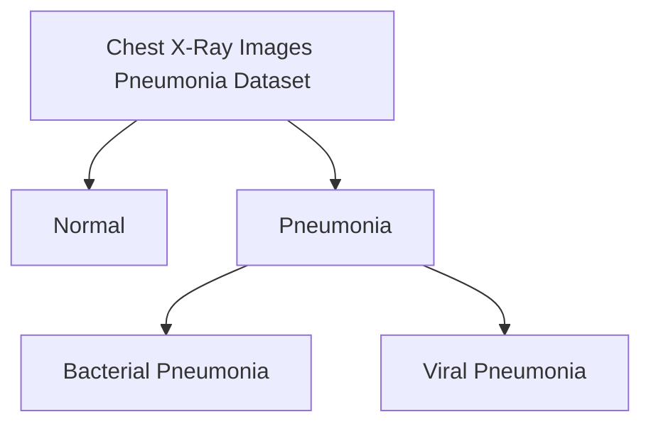

# Methodology

### Dataset Overview and Preprocess

[Kaggle dataset screenshot]
In the field of medical image analysis, automated diagnosis of chest X-rays is of paramount importance. The dataset used in this study is the “Chest X-Ray Images (Pneumonia)” dataset, provided by Paul Timothy Mooney and available on Kaggle. This dataset is specifically designed for the task of pneumonia detection and classification, offering a substantial resource for training and evaluating medical image analysis models.

#### Dataset Description

The “Chest X-Ray Images (Pneumonia)” dataset comprises a total of 5,863 chest X-ray images, categorized into two main classes:

1. **Normal**: Images in this category show no signs of pneumonia and represent normal chest X-ray findings.
2. **Pneumonia**: Images in this category display signs of pneumonia. This category is further subdivided into:
   - **Bacterial Pneumonia**: X-ray images showing pneumonia caused by bacterial infections.
   - **Viral Pneumonia**: X-ray images showing pneumonia caused by viral infections.

#### Dataset Structure

The dataset is organized into three primary folders based on usage:

- **train**: Contains images used for training the model.
- **val**: Contains images used for validating the model's performance during training.
- **test**: Contains images used for testing the model's final performance.

Each primary folder is further divided into two subfolders:

- **NORMAL**: Contains images of normal chest X-rays.
- **PNEUMONIA**: Contains images of chest X-rays with pneumonia signs, further divided into bacterial and viral pneumonia.

#### Importance of the Dataset

This dataset is of significant value in the realm of automated medical diagnosis. By providing a diverse set of chest X-ray images, it offers crucial support for developing and evaluating deep learning models. Researchers can use these images to train efficient classification models that automatically detect and categorize pneumonia in chest X-rays. This capability is vital for enhancing diagnostic accuracy and efficiency, particularly in settings with limited medical resources. The dataset’s ability to aid in the rapid and accurate diagnosis of pneumonia underscores its clinical relevance and utility.

**key point**:

- **Dataset Value**: It is highly valuable for automated medical diagnosis.
- **Content**: Provides a diverse set of chest X-ray images to support the development and evaluation of deep learning models.
- **Application**: Useful for training efficient classification models to automatically detect and categorize pneumonia.
- **Clinical Significance**: Enhances diagnostic accuracy and efficiency, especially in settings with limited medical resources.
- **Utility**: Facilitates rapid and accurate pneumonia diagnosis, underscoring the dataset’s clinical relevance and utility.

#### Data Preprocess

> 图像预处理的过程分为以下几步
>
> 1. 统一大小到 224 x 224 pixels
> 2. 计算训练数据的统计数据，对平均值和标准差进行归一化处理
> 3. 执行自定义直方图均衡化
> 4. 进行 k 折交叉验证
> 5. 提供三个通道的张量图像

Image preprocessing is a crucial step to ensure the effectiveness of model training and to improve prediction accuracy. Below is a detailed description of the image preprocessing steps:

1. **Resize to 224 x 224 pixels**  
   In the initial stage of image processing, all images are resized to a uniform dimension of 224 x 224 pixels. This step ensures that the input data has a consistent shape, allowing the model to accept and process the image data. Typically, image scaling techniques are used to achieve this, while maintaining the aspect ratio to minimize distortion.

2. **Normalize using mean and standard deviation calculated from training data**  
   Before performing normalization, we need to compute statistical data from the training dataset, including the mean and standard deviation for each channel. By normalizing each image (i.e., subtracting the mean and dividing by the standard deviation), we can scale the image data to a similar range. This helps to accelerate the model training process and improve convergence speed. Normalized data allows the model to better capture features and enhance generalization.

3. **Perform custom histogram equalization**  
   Custom histogram equalization is a technique used to enhance image contrast. By adjusting the brightness and contrast of the image, the distribution of grayscale values becomes more uniform, which improves the visibility of details. This step is particularly useful for images with low contrast and helps to increase the recognition capability of the subsequent model.

4. **Conduct k-fold cross-validation**  
   To evaluate the model's performance and prevent overfitting, we use k-fold cross-validation. The dataset is divided into k subsets, with k-1 subsets used for training and the remaining subset used for validation. This approach allows for a more reliable assessment of the model's generalization ability and helps in selecting the best model parameters.

5. **Provide tensor images with three channels**  
   The final processed images are provided as tensors with three channels, representing the red, green, and blue channels (RGB). This format meets the input requirements of most deep learning models, enabling the model to fully utilize the color information of the images for training and prediction.

Through these preprocessing steps, we effectively prepare the image data, ensuring it meets the model's input requirements and improving the model's training efficacy and prediction accuracy.

## Modeling

Basic Model
simply introduce 2 model
ResNet
DINO ViT-B/16

### Gradient descent algorithm for pre-training and fine-tuning

Using gradient descent algorithm, we have trained following model in our dataset:

1. ResNet18 trained from scratch
2. ResNet18 where all parameters trained after transfer learning initialization
3. Resnet18 where the last linear layer is fine-tuned after transfer learning initialization
4. DINO ViT-B/16 model fine-tuned using a linear classifier.

### Training Specifications for Gradient Descent Methods

> key point:
>
> - **Optimizer**: Used the Adam optimizer with weight decay for regularization.
> - **Hyperparameter Tuning**: Performed a grid search to find the best batch size, learning rate, and weight decay rate.
> - **Cross-Validation**: Employed 5-fold cross-validation, splitting the training data into 80% for training and 20% for validation.
> - **Model Selection**: Chose the model with the highest validation F1-score for reporting test set performance.
> - **Data Augmentation**: Applied techniques like random horizontal flipping, rotations (up to 10 degrees), and Gaussian blur to address class imbalance during each train-validation split.
> - **Results**: Presented training parameters and results in Table 2.

For training the models, we utilized the Adam optimizer with weight decay for regularization. To determine the optimal hyperparameters, we conducted a grid search to find the best values for batch size, learning rate, and weight decay rate. Each combination was evaluated using k-fold cross-validation with \( k = 5 \).

Since we had a fixed test set, each fold of the cross-validation involved splitting the training data into 80% for training and 20% for validation. We then selected the model with the highest validation F1-score and reported its performance on the test set.

Given the imbalanced class distribution in the data, we applied data augmentation techniques during each train-validation split. These techniques included random horizontal flipping, random rotations (up to 10 degrees), and Gaussian blur. The training parameters obtained from the grid search and 5-fold cross-validation are summarized in Table 2.

### Extreme Learning Machines for Fine-tuning

Extreme Learning Machines (ELMs) [7] provide a rapid and efficient approach for training linear classifiers, especially when applied to features obtained from self-supervised models. Unlike conventional neural networks that depend on iterative backpropagation, ELMs use a simple closed-form solution to compute the output weights. This method greatly decreases computational complexity and training time.

**Key Points**

1. **Efficiency**: ELMs offer a fast and efficient way to train linear classifiers.
2. **Application**: They are particularly effective when used with features from self-supervised models.
3. **Training Method**: ELMs use a closed-form solution instead of iterative backpropagation.
4. **Advantages**: This approach reduces both computational complexity and training time.

#### forming feature matrix

[formula]
提取数个特征作为 elm 训练线性分类器
Extract several features for training a linear classifier with ELM.

#### Feature Extraction Using Principal Component Analysis (PCA)

We employed our ELM and PCA-based fine-tuning approach to train linear classifiers using the following models: 1) ResNet18, 2) ResNet50, and 3) DINO ViT-B/16. To optimize the PCA parameters for feature dimensionality reduction, we conducted a grid search combined with 5-fold cross-validation. The results for the ELM-based models are summarized in Table 3.

Key Points

1. **Models Used**: Trained linear classifiers using ResNet18, ResNet50, and DINO ViT-B/16 with ELM and PCA-based methods.
2. **Optimization**: Performed grid search and 5-fold cross-validation to find the optimal PCA parameters for feature reduction.
3. **Results**: Results for ELM-based models are presented in Table 3.

# Result

> 最佳表现模型: DINO ELM (M7) 模型在多类肺炎分类的测试集中表现最佳，F1-Score 为 84.27%，准确率为 90.28%。该模型结合了自监督变换器和极限学习机，显示出强大的泛化能力。
>
> 第二佳表现模型: ResNet18 FT (M3)，即仅对最后一层进行微调，F1-Score 为 77.82%，准确率为 86.00%。
>
> 其他模型表现:
>
> ResNet18 ELM (M4) 和 ResNet50 ELM (M5) 表现逊色于 DINO ELM，特别是 M5 性能较差，提示模型复杂度增加而未适当微调可能导致次优结果。
> 从零开始训练的 ResNet18 (M1) 和迁移学习初始化的 ResNet18 (M2) 在训练集上的表现最优，但在测试集上的泛化能力较差，F1-Score 分别为 69.74% 和 73.54%。
> 统计验证: 使用 McNemar-Bowker 测试对模型进行配对预测的差异进行统计验证，发现 DINO ELM 与其他模型之间的差异显著，p 值小于 0.05。这验证了性能指标的真实差异。
>
> 结论: 结合自监督学习和极限学习机的方法在医学图像分析中具有显著的模型泛化能力和分类准确性，尤其在数据稀缺的环境中具有潜力。

**Best Performing Model**: The DINO ELM (M7) model achieved the highest performance in multi-class pneumonia classification with an F1-Score of 84.27% and an accuracy of 90.28%. This model combines self-supervised transformers and extreme learning machines, demonstrating strong generalization capabilities.

**Second Best Model**: The ResNet18 FT (M3) model, which only fine-tunes the last layer, achieved an F1-Score of 77.82% and an accuracy of 86.00%.

**Other Models' Performance**:

- **ResNet18 ELM (M4) and ResNet50 ELM (M5)**: These models performed worse than DINO ELM, with M5 showing particularly poor performance. This suggests that increased model complexity without proper fine-tuning may lead to suboptimal results.
- **ResNet18 (M1) trained from scratch and ResNet18 (M2) with transfer learning initialization**: These models performed best on the training set but had poor generalization on the test set, with F1-Scores of 69.74% and 73.54%, respectively.

**Statistical Validation**: McNemar-Bowker test was used to statistically validate the differences in paired predictions of models, revealing significant differences between DINO ELM and other models, with a p-value less than 0.05. This confirms the genuine difference in performance metrics.

**Conclusion**: The approach combining self-supervised learning and extreme learning machines shows significant model generalization and classification accuracy in medical image analysis, particularly in data-scarce environments.

---

The results presented in Table 3 highlight a significant performance variation among the different models and methodologies used for multi-class pneumonia classification from X-ray images. Notably, the DINO ELM (M7) model, which integrates a self-supervised transformer with Extreme Learning Machines (ELMs), achieved the highest performance on the test set, with an F1-Score of 84.27% and an accuracy of 90.28%. This superior performance underscores the effective generalization capability of self-supervised models and ELMs in handling unseen data.

In comparison, the ResNet18 FT (M3), which involves fine-tuning the final layer, demonstrated the second-best performance with an F1-Score of 77.82% and an accuracy of 86.00%. The results suggest that self-supervised learning can effectively harness large-scale, unlabeled data to capture detailed feature representations, which transfer learning models might overlook. Although both ResNet18 ELM (M4) and ResNet50 ELM (M5) also employed ELMs, their performance lagged behind that of DINO ELM, with M5 exhibiting particularly poor results. This suggests that increased model complexity without proper fine-tuning can lead to suboptimal performance.

Additionally, ResNet18 trained from scratch (M1) and Transfer Learning initialized ResNet18 (M2) achieved the highest performance on the training set but showed a marked decline in generalization to the test set, with F1-Scores of 69.74% and 73.54%, respectively.

To substantiate the performance differences among models, we employed the McNemar-Bowker Test, an extension of McNemar’s Test for multi-class scenarios, to compare paired predictions. This statistical method assesses disagreements between the predictions of various classifiers using a contingency table based on the test dataset predictions. The test statistic follows a chi-squared distribution, with the resulting p-value indicating the statistical significance of the prediction differences. For instance, the comparison between ResNet18 (M1) and DINO ELM (M7) revealed significant differences, with a p-value less than 0.05, confirming the disparity in model predictions. This validation ensures that the performance metrics accurately reflect real differences.

Table 4 presents the pairwise McNemar-Bowker Test p-values for the comparisons between the outputs of the models listed in Table 3. Significant p-values (typically less than 0.05) highlight statistically significant performance differences between paired classifiers. These results reinforce the effectiveness of combining self-supervised learning with Extreme Learning Machines, particularly in enhancing model generalization and classification accuracy in medical image analysis. This approach shows promise for developing efficient diagnostic tools, especially in data-scarce environments.
